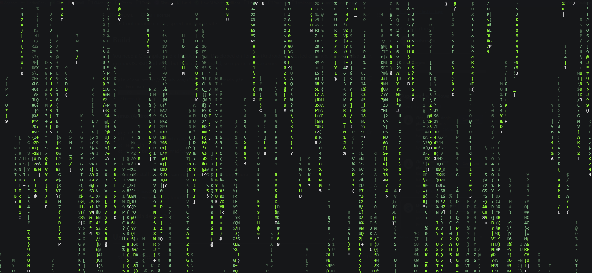

# Termrain

Matrix-style "digital rain" for your terminal, written in a single C file with no dependencies.



## Features

- Single file, plain C, no libraries (no ncurses needed)
- Smooth animation with a fixed-timestep loop
- Fading tails: white head, bright, normal, then dim trails
- Handles terminal resizing live
- Restores your terminal cleanly on exit (`q`, Ctrl+C, SIGTERM, SIGHUP)
- Runs on the alternate screen, so your shell history is left untouched
- Configurable colour, speed and frame rate

## Build

You need a C compiler and a POSIX system. Developed on Termux (Android) and tested on Linux. It should also work on macOS, BSD and WSL, but those are untested, so reports are welcome.

```sh
git clone https://github.com/slashstroke/Termrain.git
cd Termrain
cc -O2 -Wall -Wextra -o termrain Termrain.c
./termrain
```

**Termux (Android):**

```sh
pkg install clang git
git clone https://github.com/slashstroke/Termrain.git
cd Termrain
cc -O2 -o termrain Termrain.c
./termrain
```

**Optional: install it so you can run `termrain` from anywhere**

```sh
# Linux / macOS
sudo cp termrain /usr/local/bin/

# Termux
cp termrain $PREFIX/bin/
```

## Usage

```
termrain [options]
```

| Option     | Description                                            | Default |
|------------|--------------------------------------------------------|---------|
| `-f FPS`   | Frames per second (1-120)                              | `20`    |
| `-s SPEED` | Speed multiplier (0.1-10)                              | `1.0`   |
| `-c COLOR` | `green` `red` `blue` `yellow` `cyan` `magenta` `white` | `green` |
| `-h`       | Show help                                              |         |
| `-v`       | Show version                                           |         |

Examples:

```sh
./termrain                    # classic green
./termrain -c cyan -s 0.7     # slower, cyan
./termrain -f 60 -s 2         # fast and very smooth
```

Quit with **q** or **Ctrl+C**.

## Requirements

- A terminal with ANSI escape code support (virtually all modern terminals)
- Must be run in a real terminal. Online compilers that only capture output (Programiz, OnlineGDB, etc.) can't display it, and the program will tell you so.

## How it works

Each screen column is an independent "drop" with its own position, speed and tail length. Glyphs live in a persistent grid and a small percentage flicker each frame. Every frame is assembled into one buffer and sent with a single `write()`, and colour codes are only emitted when the colour changes, which keeps output small and fast.

## Tweaking

A few constants at the top of `Termrain.c` are worth playing with:

- `GLYPHS`: the character set used for the rain
- `MUTATE_DIV`: how much the glyphs flicker (lower means more flicker)
- `MIN_LEN`: the shortest tail length

## Known limitations

- ASCII glyphs only (no katakana yet)
- Ctrl+Z (suspend) isn't handled specially

## Contributing

Issues and pull requests are welcome. Before sending a change, compile with `-Wall -Wextra -Wpedantic` (any recent `gcc` or `clang` accepts these) and make sure it produces no new warnings.

## License

MIT. See [LICENSE](LICENSE).
